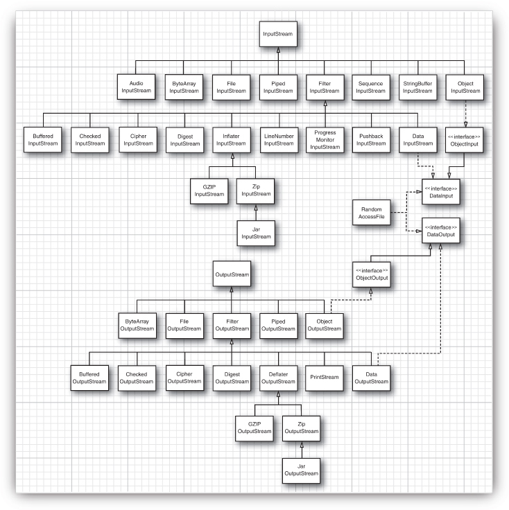
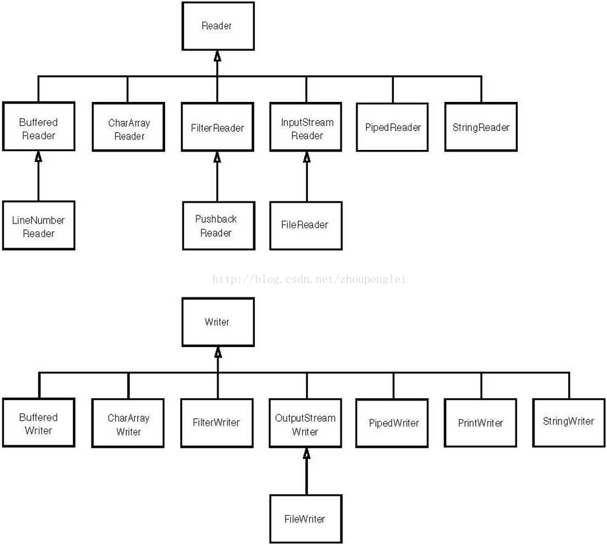
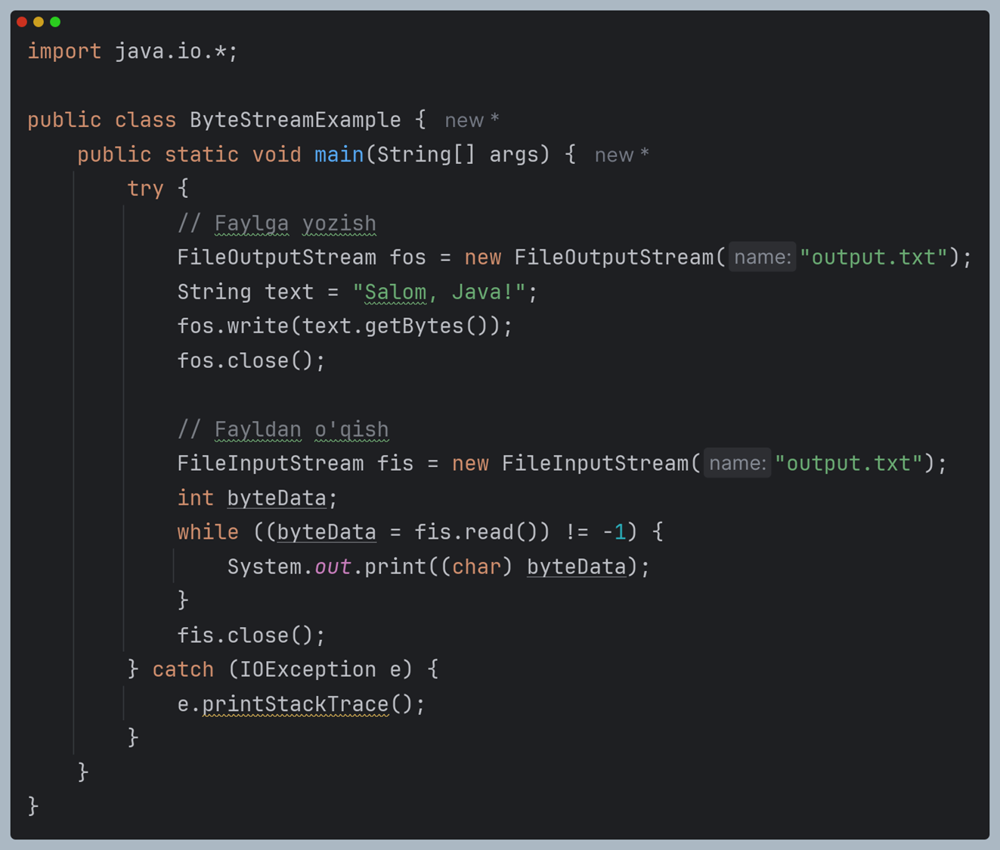
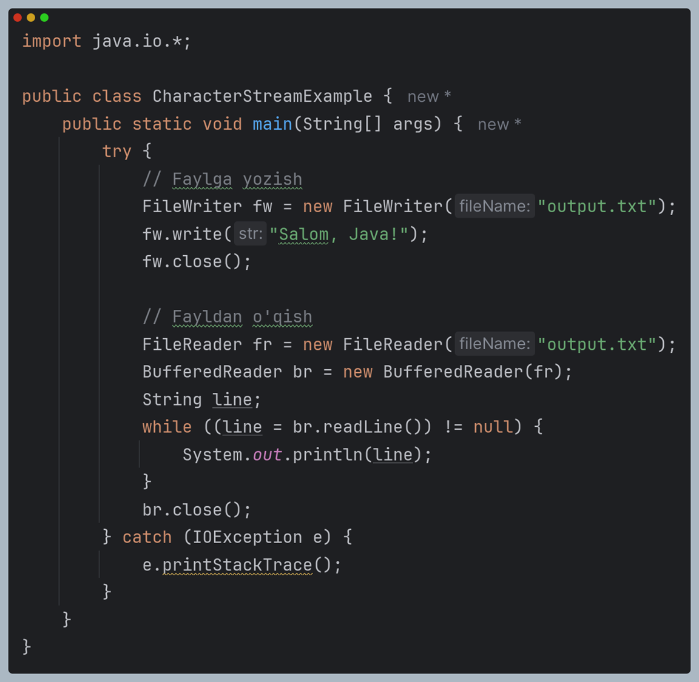
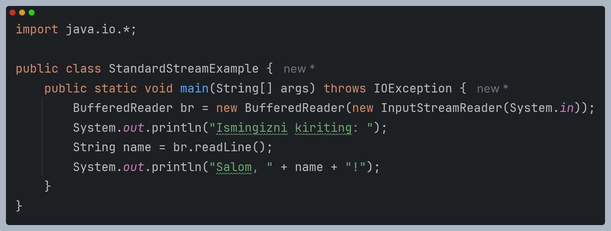

# Input/Output Streams

***
# Read/Write

## Byte Streams

```java
public class ByteStreamExample {
    public static void main(String[] args) {
        try {
            // Faylga yozish
            FileOutputStream fos = new FileOutputStream("output.txt");
            String text = "Salom, Java!";
            fos.write(text.getBytes());
            fos.close();

            // Fayldan o'qish
            FileInputStream fis = new FileInputStream("output.txt");
            int byteData;
            while ((byteData = fis.read()) != -1) {
                System.out.print((char) byteData);
            }
            fis.close();
        } catch (IOException e) {
            e.printStackTrace();
        }
    }
}
```
***
## Character Streams

```java
import java.io.*;

public class CharacterStreamExample {
    public static void main(String[] args) {
        try {
            // Faylga yozish
            FileWriter fw = new FileWriter("output.txt");
            fw.write("Salom, Java!");
            fw.close();

            // Fayldan o'qish
            FileReader fr = new FileReader("output.txt");
            BufferedReader br = new BufferedReader(fr);
            String line;
            while ((line = br.readLine()) != null) {
                System.out.println(line);
            }
            br.close();
        } catch (IOException e) {
            e.printStackTrace();
        }
    }
}
```
***
## Standard Streams

```java
import java.io.*;

public class StandardStreamExample {
    public static void main(String[] args) throws IOException {
        BufferedReader br = new BufferedReader(new InputStreamReader(System.in));
        System.out.println("Ismingizni kiriting: ");
        String name = br.readLine();
        System.out.println("Salom, " + name + "!");
    }
}
```